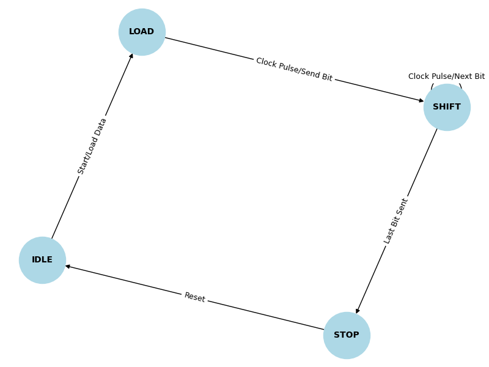
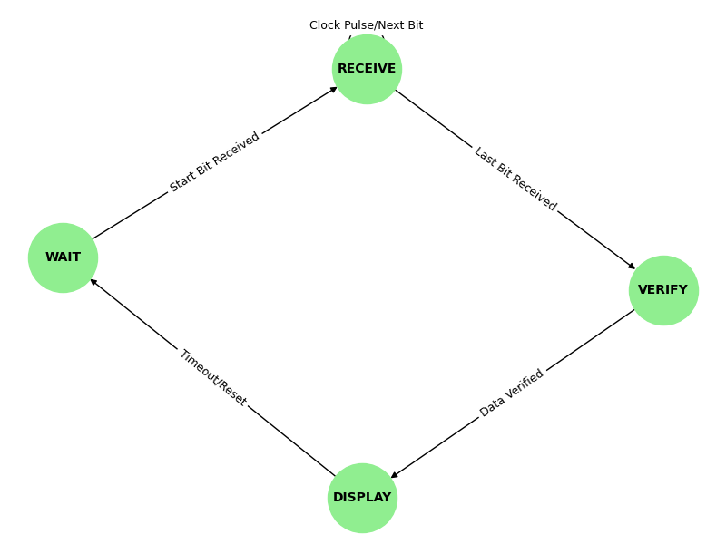
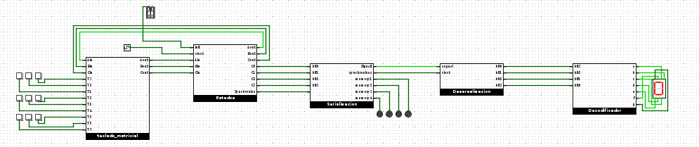

# Primer-Parcial

## 1. Implementación de Luces Parpadeantes en Semáforo

### Descripción
Se implementaron luces parpadeantes en un semáforo con el siguiente comportamiento:
- **Luz amarilla**: Parpadea en intervalos regulares.
- **Luz verde**: Parpadea varios ciclos antes de cambiar a amarillo, alertando a los conductores del cambio próximo.

### Tablas y Ecuaciones

#### Tabla de Estados
```
C    B    A    Y    G
0    0    0    0    0
0    0    1    0    1
0    1    0    0    0
0    1    1    0    1
1    0    0    0    0
1    0    1    0    1
1    1    0    0    0
1    1    1    1    0
```

Ecuaciones:
```
G = C'B'A + C'BA + C'B'A
G = C'A
Y = CBA
```

### Materiales Entregables
- **Video de simulación**: [Ver en YouTube](https://youtu.be/WIduIAY3XCY)
- **Imagen de referencia**: `Imagenes/traffic_light_fsm.png`
- **Archivo de simulación**: `Simulador/Contador_1.circ`

---


# 2.Explicación de SERDES y su Aplicación en UART

## Introducción
Un **SERDES** (Serializador/Deserializador) es un sistema que convierte datos paralelos en una secuencia serial y viceversa. Se utiliza en aplicaciones de comunicación digital donde se requiere transmitir múltiples bits a través de una línea de datos reducida.

En este documento, se explicará cómo implementar un sistema UART básico utilizando solo **4 bits** manipulados manualmente, pasando por las etapas de **serialización, transmisión y deserialización**, para finalmente decodificar y mostrar los datos en un display.

## Componentes Principales
Para la implementación del SERDES, se emplearán los siguientes elementos:
- **Compuertas lógicas** para el control del flujo de datos.
- **Flip-flops** para el almacenamiento temporal de los bits.
- **Multiplexador** Para enviar los datos por un a sola salida
- **Clock** para sincronización del proceso de transmisión y recepción.

## Flujo del Proceso
1. **Entrada Manual de Datos**: Se introducirán 4 bits de datos mediante interruptores o una interfaz similar.
2. **Serialización**: Los bits se enviarán secuencialmente a través de un canal de transmisión utilizando flip-flops y lógica de control.
3. **Transmisión**: El flujo de bits viajará sincronizado por una señal de reloj.
4. **Deserialización**: En el extremo receptor, los bits se reconstruirán en su formato original.
5. **Decodificación y Visualización**: Finalmente, los datos serán mostrados en un display de 7 segmentos o similar.

Este proyecto servirá como una demostración práctica del funcionamiento de UART a nivel fundamental, permitiendo una comprensión clara del proceso de transmisión y recepción de datos en sistemas embebidos y de comunicación digital.


## Implementación del Proyecto

El proyecto se basa en el uso de un teclado matricial de 3x3, que genera pulsos dependiendo de la tecla presionada, permitiendo la introducción de números del 0 al 9.

El teclado está controlado por una máquina de estados, que es manejada por una señal de reloj. Esta máquina de estados descompone la entrada en 4 bits binarios, convirtiendo el número decimal ingresado en su equivalente binario.

**Serialización de Datos**

Una vez que el número ha sido convertido a su representación binaria, se inicia el proceso de serialización mediante un multiplexor. Este multiplexor gestiona la transmisión de los datos en el siguiente orden:

1. Se envía un bit de inicio (1) para indicar que la transmisión comenzará.

2. Se transmiten los 4 bits que representan el número ingresado.

3. Se envía un bit de finalización (0) para señalar que la transmisión ha terminado.

En total, el proceso de transmisión consta de 6 bits sincronizados por el reloj, asegurando que la información se envíe y reciba de manera correcta.

**Deserialización de Datos**

El deserializador recibe los **6 bits** transmitidos y los almacena en **6 flip-flops** dispuestos en cascada, permitiendo que los bits se organicen secuencialmente.

Cuando el **flip-flop de inicio** y el **flip-flop de parada** detectan sus respectivos bits, activan una compuerta **AND** que habilita el almacenamiento de los **4 bits de datos** en los siguientes flip-flops y reinicia los que están conectados en cascada. De esta manera, la salida se reconstruye en su formato paralelo original.

Una vez restaurados los **4 bits**, estos son dirigidos a un **decodificador de 0 a F**. Aunque este decodificador tiene capacidad para representar valores de **0 a 15** en hexadecimal, solo se utilizarán los valores de **1 a 9**, correspondientes a los números ingresados en el teclado matricial.

Finalmente, los datos reconstruidos pueden ser enviados a un **display de 7 segmentos** o un sistema de visualización adecuado para su interpretación.

|Mealy | Moore|
|-----------|-----------|
|  |  |

**Imagen del circuito**
            

**Video del proyecto**
[Ver Video en YouTube](https://youtu.be/mNCzB2ru-tY)

- **Archivo de simulación**: `Simulador/SERDES.circ`
---
# 3. Timing Analysis

## **Estructura del Circuito**

El circuito está compuesto por los siguientes bloques:

### **1. Bloque Estado**

-   3 flip-flops en cascada
-   Conexión AND-OR-AND
-   Conexión AND-OR-NOR-AND

### **2. Bloque Serializador**

-   Conexión OR-AND-Clock de Flip-Flop D de almacenamiento
-   Conexión Flip-Flop D-AND-OR
-   Contador de 3 bits:
    -   **bit0:** Primera salida Flip-Flop D.
    -   **bit1:** Segunda salida Flip-Flop D con XOR que cambia la entrada del segundo flip-flop con la primera salida del flip-flop.
    -   **bit2:** Tercera salida Flip-Flop D con una conexión AND-OR-Entrada Flip-Flop D.
-   Bloqueo del Clock con una conexión NOT-NAND-AND-OR-AND del contador.

### **3. Bloque Deserializador**

-   6 flip-flops en cascada con el mismo clock
-   Reset con un AND-Salida de Flip-Flop D
-   4 flip-flops que almacenan datos de los flip-flops que están en cascada

### **4. Bloque Decodificador**

-   Conexión NOT-AND-OR
-   Conexión AND-OR

----------

## **Parámetros Temporales de los Componentes Utilizados**

### **1. Flip-Flop Tipo D - SN74HC74**

-   **T_clk-Q:** 7 ns (máximo, para Vcc = 4.5V)
-   **T_setup:** 20 ns (mínimo, para Vcc = 4.5V)
-   **T_hold:** 0 ns (para Vcc = 4.5V)
-   **Frecuencia máxima del reloj:** 31 MHz (para Vcc = 4.5V)

### **2. Contador de 3 bits - 74HC161**

-   **T_clk-Q:** 14 ns (máximo, para Vcc = 4.5V)
-   **T_setup:** 10 ns (mínimo, para Vcc = 4.5V)
-   **Frecuencia máxima del reloj:** 29 MHz (para Vcc = 4.5V)

### **3. Compuerta AND - SN74AUP1G08**

-   **T_prop:** 4.3 ns (máximo, para Vcc = 3.3V)

### **4. Decodificador BCD a Display de 7 Segmentos - CD74HC4511**

-   **T_prop:** 25 ns (máximo, para Vcc = 5V)

### **5. Otras Compuertas Lógicas (NAND, OR, NOR, XOR) - Familia 74HC**

Como el **SN74AUP1G08** pertenece a la familia lógica **74HC**, las demás compuertas como **NAND (SN74HC00), OR (SN74HC32), NOR (SN74HC02), XOR (SN74HC86)** tienen tiempos de propagación similares dentro del mismo rango de voltaje.

----------

## **Cálculo de la Frecuencia Máxima de Operación**

Para determinar la **frecuencia máxima de operación**, utilizamos la ecuación:
$$
Tclk≥Tclk−Q+Tlogic+TsetupT_{clk} \geq T_{clk-Q} + T_{logic} + T_{setup}
$$
Donde:
-   **T_clk-Q = 14 ns** (por el 74HC161, que es el componente más lento)
-   **T_logic = 4.3 ns** (por la compuerta AND más rápida en el sistema)
-   **T_setup = 10 ns** (por el 74HC161)

Sustituyendo valores:
$$
Tclk≥14+4.3+10=28.3 nsT_{clk} \geq 14 + 4.3 + 10 = 28.3 \text{ ns}
$$
La frecuencia máxima del circuito se calcula como:
$$
fmax=1Tclkf_{\text{max}} = \frac{1}{T_{\text{clk}}} fmax=128.3×10−9f_{\text{max}} = \frac{1}{28.3 \times 10^{-9}} fmax≈35.3 MHzf_{\text{max}} \approx 35.3 \text{ MHz}
$$
Esto significa que el circuito **puede operar hasta aproximadamente 35 MHz** antes de violar tiempos de propagación.

----------

## **Verificación de la Restricción de Hold**

Para cumplir la restricción de hold, la siguiente ecuación debe cumplirse:
$$
Tclk-Q+Tlogic≥TholdT_{\text{clk-Q}} + T_{\text{logic}} \geq T_{\text{hold}}
$$
Sustituyendo los valores:
$$
14+4.3=18.3 ns≥0 ns14 + 4.3 = 18.3 \text{ ns} \geq 0 \text{ ns}
$$
Como la condición se cumple, **el circuito es seguro en términos de retención de datos**.

----------

## **Conclusión**

-   **Frecuencia máxima del circuito:** ~35 MHz.
-   **La restricción de hold se cumple**, asegurando estabilidad en la retención de datos.
-   **Las demás compuertas lógicas de la familia 74HC tienen tiempos similares**, por lo que se pueden considerar dentro del mismo análisis.

Este análisis permite validar la operación correcta del circuito bajo los parámetros de tiempo de los componentes utilizados. 🚀

# Vending Machine FSM (Máquina expendedora de 3Q)

Este proyecto implementa una máquina de estados finitos para una expendedora de Q3 usando SystemVerilog, VHDL y simulación en Logisim-Evolution.

## 🔧 Módulos

- `fsm_controller`: controla el cambio de estado
- `credit_output`: genera la salida de crédito
- `vending_fsm_top`: une ambos módulos
- `logisim/`: contiene la versión visual para simular en Logisim

## 🧪 Simulación

Podés simular con ModelSim o Vivado, y también probarlo visualmente en Logisim con HDL Simulation habilitado.


**Video del proyecto**
[Ver Video en YouTube](https://youtu.be/DQt-0bW2Cig)

[Ver proyecto en Drive](https://drive.google.com/drive/folders/1hcWzh3fDUUttIKZvXMyJU5xw6KZZ_uUT?usp=drive_link)
